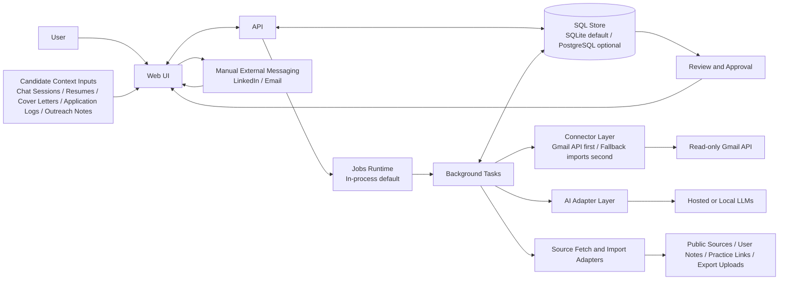

# NetworkPipeline V1 Design Proposal

## 1. Status

Status: `proposed`

This document is the approval gate for V1 design. Implementation should not proceed beyond repository scaffolding until this design is reviewed and accepted.

## 2. Problem

NetworkPipeline is intended to help a solo job seeker run a modern job search as a relationship pipeline instead of a cold-application funnel.

The system needs to combine three things that are usually split across separate tools:

- a canonical model of the candidate, including their background, goals, constraints, and artifacts, even when that context is currently scattered across many chat sessions and documents
- a private CRM for people, companies, roles, applications, referrals, and alumni paths
- a safe outreach copilot that drafts and prioritizes but does not auto-message contacts
- a technical preparation engine that uses structured planning plus current, source-backed interview research

## 3. V1 Product Goal

V1 should let a solo user:

1. consolidate their own fragmented job-search context into one reviewable system of record
2. track target roles, applications, people, and referral paths in one system
3. identify the best contact path into a role, including education signals such as alumni overlap
4. generate and review personalized outreach drafts with explicit human approval before sending
5. manage technical prep tied to target roles, interview loops, and recent interview evidence
6. swap AI providers without changing the core product architecture

## 4. Non-Goals

V1 does not aim to:

- auto-send messages on LinkedIn, email, or other platforms
- scrape unauthorized platform data
- act as a full ATS for recruiting teams
- require a proprietary SaaS backend operated by this project
- optimize for multi-user collaboration before the solo-user path works well

## 5. Design Principles

- `User-model first`: the system must understand the candidate before it tries to optimize the search
- `Human-in-the-loop`: recommendations are separate from execution
- `Open-source first`: self-hosting and replaceable components are first-class
- `Source-aware`: time-sensitive claims need provenance and freshness metadata
- `Provider-agnostic`: model vendors are adapters, not hard dependencies
- `Low-ops V1`: architecture should stay simple enough for solo-user deployment

## 6. Primary User Flows

### 6.1 Context Consolidation Flow

1. User uploads or pastes resumes, cover letters, prior applications, outreach logs, referral notes, and chat history.
2. System stores the raw material and extracts candidate facts, application history, outreach history, and preferences.
3. System proposes a canonical candidate profile, asset library, and structured records for user review.
4. User corrects, approves, or rejects extracted facts.
5. Only approved context becomes eligible for ranking, drafting, and prep recommendations.

### 6.2 Outreach Flow

1. User creates or imports a `Role`, `Company`, and relevant `Person` records.
2. System ranks likely helpful contacts using relationship, company, and education signals.
3. User selects a contact and an outreach intent.
4. System generates one or more drafts plus rationale and evidence.
5. User edits and approves a draft.
6. User sends it manually outside the system.
7. User records sent state and any reply outcome.

### 6.3 Prep Flow

1. User creates a target role or interview loop.
2. System collects evidence from user notes, recruiter notes, and public interview sources.
3. System generates a prep plan and prioritized backlog.
4. User links or creates practice items such as LeetCode problems.
5. User logs prep sessions, difficulty, and confidence.
6. System adapts future priorities based on struggle signals and upcoming interview timing.

## 7. User Understanding Requirements

The system should not act like a generic job-search assistant. It should understand the specific candidate through a canonical internal profile.

At minimum, the system needs to model:

- current role and professional background
- work history and major achievements
- education history, including alumni-relevant signals
- applications already sent
- who the user has already reached out to and how those interactions went
- dream-job criteria
- acceptable-job criteria
- location, compensation, and domain constraints
- versions of resumes, cover letters, and referral notes
- historical context currently trapped in chat sessions or notes

This is not optional context. It is foundational product data.

## 8. Proposed System Shape

V1 should be a modular monolith with these deployable components:

- `web`: primary user interface
- `api`: domain API and command boundary
- `jobs`: background execution for AI tasks and ingestion
- `sql store`: `SQLite` by default, with a schema that remains compatible with `PostgreSQL`
- `artifact store`: local filesystem by default
- `connector layer`: external-data adapters, with Gmail API read-only integration as the preferred first email connector
- optional local or remote model endpoints behind adapters

This shape is chosen because it is:

- simple enough to self-host
- modular enough to preserve boundaries
- flexible enough to support background work and multiple AI providers

## 8.5 Deployment Strategy

Deployment should follow a tiered model:

1. `default`: native localhost run with embedded `SQLite`, local filesystem storage, and in-process jobs
2. `secondary`: Docker Compose for a more standardized environment or upgraded services
3. `future`: hosted or multi-user deployment

Why this order:

- the easiest first-run experience for solo users is a native local app, not a container stack
- Docker is still useful for contributors and more reproducible advanced setups
- hosted deployment is valuable later, but it should not drive V1 complexity

## 9. Data Flow Chart

Interpretation:

- the user interacts only through the `Web UI`
- candidate context enters the system through explicit user-provided artifacts and imported history
- the preferred first email-ingestion path is a read-only Gmail API connector
- if that connector fails because of account policy or OAuth restrictions, fallback ingestion still enters through the same review pipeline
- the `API` owns synchronous CRUD and command handling
- the `jobs runtime` handles asynchronous context extraction, drafting, ranking refreshes, prep planning, and evidence ingestion
- AI providers are isolated behind an adapter layer
- extracted candidate facts must be reviewed before becoming canonical
- sending remains manual on external platforms

## 10. Core Data Model

V1 should treat the following as first-class entities:

- `CandidateProfile`
- `ExperienceRecord`
- `Person`
- `EducationRecord`
- `Company`
- `Role`
- `Application`
- `ApplicationAsset`
- `ConversationImport`
- `RoleContact`
- `ReferralPath`
- `OutreachThread`
- `MessageDraft`
- `InterviewLoop`
- `PrepTopic`
- `PracticeItem`
- `PrepSession`
- `Task`
- `Source`
- `EvidenceItem`
- `ProviderRun`
- `OutcomeLabel`

Design intent:

- the candidate is a first-class subject in the model, not just the operator of the system
- CRM data, outreach state, prep state, and evidence should live in one coherent domain model
- education should be first-class because alumni overlap is a meaningful outreach signal
- provider runs and outcome labels should be stored so the system can be audited and improved over time

## 11. Decision Rationale

### 11.1 Why User-Model First

The system cannot make good outreach or prep decisions if it only understands the target company and target contact. It also needs to understand the candidate.

That means V1 must have a canonical internal answer to questions like:

- what background does this person actually have
- what have they already applied to
- who have they already contacted
- what counts as a dream role versus an acceptable fallback
- which resume and cover letter variants already exist
- which facts came from reliable structured input versus loose chat context

Without that layer, recommendations will be generic and repetitive.

### 11.2 Why Web-First

The product is workflow-heavy, stateful, and review-oriented. A web UI is the right primary surface for:

- multi-entity navigation
- pipeline views
- draft review and editing
- prep dashboarding
- evidence inspection

### 11.3 Why Solo-User First

The main design risks are product and workflow risks, not team-collaboration risks. Supporting teams early would add:

- authentication and workspace complexity
- permission models
- shared ownership questions
- more UI and data complexity

That would slow learning on the actual user problem.

### 11.4 Why a Hybrid Prep Engine

Prep should not be purely deterministic because recent interview patterns and explanation quality benefit from LLM synthesis. It should also not be purely LLM-driven because planning and progress tracking need auditability.

The proposed split is:

- deterministic for coverage tracking, time budgeting, revisit rules, and struggle accumulation
- LLM-assisted for synthesis, prioritization hints, and current interview-pattern research

### 11.5 Why Provider Adapters

Users will want different model setups:

- hosted APIs
- local models
- self-hosted inference endpoints
- different models per task

The system should treat those as interchangeable runtime choices, not as product-level branching.

### 11.6 Why Gmail API First For Email Ingestion

For a user who has already sent hundreds of applications, the easiest high-value ingestion path is not manual upload of individual messages.

The preferred first approach is:

- user grants read-only Gmail access once
- system performs a recent-history bulk sync
- system converts likely application and outreach messages into reviewable structured records

This is the best V1 email connector because it minimizes user effort while keeping the connector read-only.

Fallbacks are still necessary because:

- school or work accounts may restrict OAuth apps
- some users may not want broad mailbox read access
- some relevant application history may live outside Gmail

So the connector strategy should be:

1. Gmail API read-only connector first
2. fallback import methods second

### 11.7 Why SQL-First, But Not PostgreSQL-First

The core product is relational: applications, contacts, outreach threads, prep topics, evidence, and approvals all need strong joins and state transitions.

That makes SQL the right source of truth.

But `PostgreSQL` should not be the default requirement for V1 because the project is still optimizing for solo users on ordinary modern PCs.

Storage tradeoff summary:

| Option | Strengths | Weaknesses | V1 role |
|---|---|---|---|
| `SQLite` | Zero-config, single file, strong local-first ergonomics, good enough for solo use | Weaker for heavy concurrent server workloads | `Default` |
| `PostgreSQL` | Better concurrency, stronger server deployment story, richer extensions | Higher setup and operations cost | `Optional upgrade path` |
| `DuckDB` | Excellent analytics | Not a primary transactional store | `Deferred analytics tool` |
| `MongoDB` | Flexible documents | Poorer fit for relational workflow state | `Not primary` |
| `Graph DB` | Useful for graph traversal | Too much complexity for V1 | `Not primary` |
| `Vector DB` | Helpful for embeddings and semantic retrieval | Not a system-of-record database | `Secondary later if needed` |

Design conclusion:

- use `SQLite` as the default local database
- keep the schema portable to `PostgreSQL`
- store raw artifacts on the filesystem
- keep AI traces and reviewable proposals in SQL alongside canonical records

### 11.8 Why Native Localhost First

The best quick-start path for a solo user is:

- clone the repo
- install dependencies
- run one local startup command
- open the app on `localhost`

Requiring Docker for the first-run path would add:

- extra installation steps
- more memory and CPU overhead
- additional file-mount and networking failure modes
- more friction for connector flows such as local OAuth

Docker still has an important role, but it should be the secondary deployment path rather than the default required one.

## 12. Risks And Mitigations

### 12.1 Risk: Too Much Scope In V1

Combining CRM, outreach, prep, and research can sprawl.

Mitigation:

- keep V1 centered on solo-user workflows
- require one integrated flow before expanding features
- prioritize CRM plus outreach before advanced prep automation

### 12.2 Risk: Wrong Candidate Understanding

If imported chat sessions or notes are misread, the system may build a distorted view of the candidate and give bad advice.

Mitigation:

- raw context stays traceable to its source
- extracted facts require user review before becoming canonical
- candidate profile fields should be explicitly editable
- recommendations should show which candidate facts were used

### 12.3 Risk: Connector Access Fails

The preferred Gmail route may fail because of Google Workspace policy, OAuth friction, or user trust concerns.

Mitigation:

- keep email access read-only
- treat Gmail as the preferred first connector, not the only connector
- support fallback import methods such as pasted content, uploaded exports, and forwarded intake mail
- make all connector outputs flow through the same extraction and review pipeline

### 12.4 Risk: Unsafe Or Spammy Outreach

Automation pressure could push the product toward behavior that users or their contacts do not want.

Mitigation:

- draft-only external messaging
- follow-up caps and cooldowns
- do-not-contact states
- rationale and evidence display before approval

### 12.5 Risk: Stale Interview Research

Interview patterns can change, and low-quality sources can contaminate recommendations.

Mitigation:

- store source URLs and retrieval dates
- attach freshness states to evidence
- surface confidence and provenance in the UI

### 12.6 Risk: Operational Complexity

Too many moving parts would undermine the self-hosted story.

Mitigation:

- modular monolith
- one primary SQL database
- embedded `SQLite` by default
- background execution that can run in-process locally
- defer extra infrastructure until clearly needed

### 12.7 Risk: Fragmented Deployment Paths

Supporting both native local run and Docker could create drift between environments.

Mitigation:

- make native localhost the reference quick-start path
- keep Docker Compose aligned as a supported secondary path
- ensure both paths use the same migrations, config model, and app defaults

## 13. Proposed V1 Technical Direction

The current proposed reference stack is:

- `TypeScript`
- `npm workspaces`
- `Next.js`
- `Fastify`
- `SQLite` by default
- `PostgreSQL` compatibility as an upgrade path
- `Drizzle ORM`
- local filesystem artifact storage
- in-process background jobs by default
- `Zod`
- read-only Gmail API connector first, with fallback ingestion connectors
- native localhost deployment first, Docker Compose second

This is a proposal, not an approved implementation decision yet. It is included here because design approval should cover the intended implementation direction.

## 14. Approval Questions

Approval is specifically requested for:

1. the overall V1 scope and non-goals
2. the candidate-context-first design, including chat and artifact ingestion with user review
3. the modular-monolith system shape
4. the draft-only outreach model
5. the hybrid prep-engine approach
6. the proposed data model boundaries
7. the proposed reference stack direction

## 15. Supporting Docs

This design proposal is backed by:

- [Requirements](./requirements.md)
- [Domain Model](./domain-model.md)
- [Architecture](./architecture.md)
- [V1 Stack](./stack.md)
- [Schema Strategy](./schema.md)
