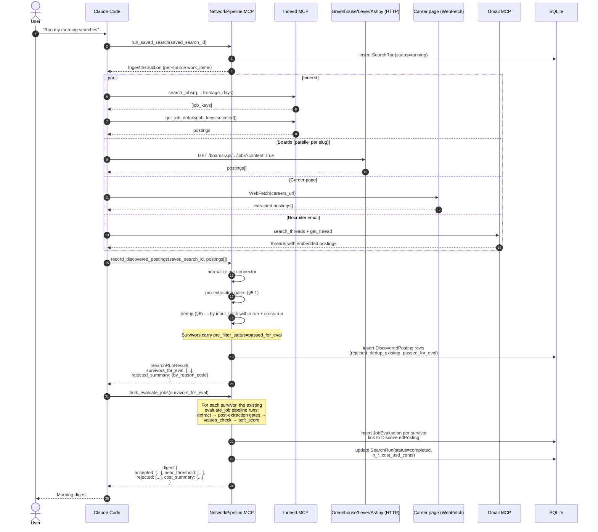

# Discovery Layer

## Status

Status: `proposed`

This document specifies the V1 discovery layer: how NetworkPipeline actively searches across multiple sources, dedups results, applies a pre-extraction subset of the criteria filter, and feeds survivors into the existing evaluation pipeline (`docs/criteria.md` §10).

## 1. Purpose

NetworkPipeline through V0 only processed postings the user pasted in front of it. The product thesis — *targeted, values-aware job search* — fails without active discovery. A criteria filter that never sees a posting is a filter that never fires.

V1 elevates discovery to first-class status. The system actively searches across:

- Indeed (driven via Claude's built-in `mcp__claude_ai_Indeed__search_jobs` tool)
- Greenhouse, Lever, Ashby public board APIs (no auth required for public boards)
- Company career pages (RSS feeds where available, WebFetch + extraction otherwise)
- Recruiter forwards landing in Gmail (Anthropic's Gmail MCP)
- Manual paste (the V0 path; preserved as a connector for completeness)

Every result still flows through hard gates (`docs/criteria.md` §6), the values check (§7), and soft scoring (§8). The user reviews before any draft is sent. **Discovery is not spray-and-apply** — it is "search the user has never had access to before, with values refusals and hard constraints enforced *before* results land."

### 1.1 What This Replaces

LinkedIn search and Indeed search rank by an opaque relevance score over keywords plus profile-fit features. They cannot:

- Express "no defense companies regardless of role content" (a values constraint, not a query).
- Express "I have 4 YoE, drop staff and principal" (a structured filter on extracted role seniority, not a keyword).
- Compose multiple refusals (`no-defense-companies` + `no-crypto-only` + `no-gambling`) without keyword gymnastics.
- Aggregate across sources with content-hash dedup.
- Use the user's accepted/rejected examples as calibration anchors that improve over time.

NetworkPipeline's discovery layer is programmable, composable, and active-learning-friendly. The criteria YAML the user already maintains *is* the search query.

## 2. Design Principles

- `Leverage don't replace` — we orchestrate sources via MCP tools and public APIs. We do **not** scrape LinkedIn, log in to private boards, or evade rate limits.
- `Values-driven exclusion at search time` — hard-gate `must_not_have.company` and the pre-extraction subset of phrase blocklists run before any expensive LLM extraction. A blocked company never reaches the values-check stage; we save the spend.
- `Hard-constraint enforcement before scoring` — pre-extraction gates (§6) cull obvious rejects. Post-extraction gates run inside `evaluate_job` exactly as they do today. Soft scoring is unchanged.
- `Dedup-by-content-hash` — same posting found via three sources collapses to one `JobEvaluation`. The first source to land wins by default; preferred-source rules (§7.3) override.
- `Active-learning friendly` — every accepted/rejected discovery flows back into calibration anchors and (via `propose_criteria_change`) into criteria diffs. Discovery sharpens the criteria, which sharpens the next discovery run.
- `Draft-only` — same rule as the rest of NetworkPipeline. Discovery surfaces; the user approves; outreach is staged. Nothing auto-applies.

## 3. Source Connector Contract

Every connector implements the same interface. The pattern matches the Gmail/Calendar instruction-callback round-trip already established in `docs/intro-paths.md` §5.5–§5.7.

```typescript
// packages/discovery/src/connectors/types.ts
export interface SourceConnector {
  /** Stable connector id; matches the discriminator in SavedSearch.sources[]. */
  id(): SourceId;

  /**
   * Phase 1: NetworkPipeline returns an instruction payload describing what
   * Claude (or, for HTTP-direct connectors, the connector itself) should
   * fetch. NetworkPipeline does NOT make outbound HTTP calls in this phase.
   */
  discover(
    query: SourceQuery,
    opts: DiscoverOptions
  ): Promise<IngestInstruction>;

  /**
   * Phase 2: Claude (or the connector's HTTP-direct path) fetches per the
   * instruction and calls back with raw payloads. recordResults normalizes
   * to NormalizedDiscoveredPosting and persists to discovered_postings.
   */
  recordResults(
    rawPayloads: unknown[]
  ): Promise<NormalizedDiscoveredPosting[]>;
}

export type SourceId =
  | "indeed"
  | "greenhouse"
  | "lever"
  | "ashby"
  | "career_page"
  | "recruiter_email"
  | "manual_paste";

export interface IngestInstruction {
  connector: SourceId;
  // The MCP/HTTP work Claude (or the connector) must run.
  work_items: WorkItem[];
  callback_tool: "record_discovered_postings";
  report_schema_url: string; // networkpipeline://schemas/discovered_posting.json
}

export interface NormalizedDiscoveredPosting {
  source_id: SourceId;
  source_external_id: string;     // e.g. Greenhouse job id, Indeed job key
  url_canonical: string;
  title: string;
  company: string;
  location_text: string | null;
  employment_type_hint: EmploymentType | null;  // best-effort from metadata
  seniority_hint: SeniorityBand[] | null;        // regex over title
  description_text: string | null;               // some sources include; some don't
  posted_at: string | null;                      // ISO-8601
  raw_metadata_json: Record<string, unknown>;    // preserved verbatim
  input_hash: string;                            // sha256(trimmed first 8 KiB)
}
```

### 3.1 Why two phases

The two-phase split mirrors `ingest_gmail_interactions` (`docs/architecture.md` §8). It exists for two reasons:

- **Credential isolation.** Source MCP tools (Indeed, Gmail) hold their credentials inside Claude's sandbox. NetworkPipeline never sees them.
- **Cost predictability.** Claude can fan out instructions in parallel under its own rate-limiting and retry semantics. NetworkPipeline becomes a pure persistence + filtering target.

### 3.2 Why a normalized row, not raw

`raw_metadata_json` preserves whatever the source returned for forensic value, but the gates in §6 only ever read normalized fields. Adding a new source means writing one connector — no new gate code.

## 4. V1 Connectors

Each connector subsection lists: auth, the instruction shape, the metadata returned, and which fields are required vs optional.

### 4.1 Indeed connector

- `id`: `indeed`
- `auth`: none from NetworkPipeline's side. Claude uses the Anthropic-hosted `mcp__claude_ai_Indeed__*` tools.
- `instruction`: `{ tool: "mcp__claude_ai_Indeed__search_jobs", queries: [{ q, l, fromage_days, max_results }] }` plus a follow-up `{ tool: "mcp__claude_ai_Indeed__get_job_details", job_keys: [...] }` for selected results.
- `returns`: title, company, location, posted-at, snippet, URL. `description_text` requires the second `get_job_details` call.
- **Required**: `source_external_id` (Indeed job key), `title`, `company`, `url_canonical`.
- **Optional**: `description_text` (only if `get_job_details` was called for that key), `posted_at`, `location_text`.
- **Rate limiting**: handled by the Indeed MCP itself. The connector imposes no additional cap.

### 4.2 Greenhouse connector

- `id`: `greenhouse`
- `auth`: none for public boards. Private boards are V2 (`docs/evaluation.md` §10).
- `endpoint`: `https://boards-api.greenhouse.io/v1/boards/{company}/jobs?content=true`
- `instruction`: `{ tool: "WebFetch", urls: [endpoint], extract_schema: GREENHOUSE_BOARD_SCHEMA }`. Or the connector's HTTP-direct path can fetch when run from the worker (no credentials needed).
- `returns`: full posting list with title, location, departments, full HTML body when `content=true`.
- **Required**: `source_external_id` (Greenhouse job id), `title`, `company` (the `{company}` slug), `url_canonical`, `description_text`.
- **Optional**: `location_text`, `posted_at`.
- **Rate limiting**: Greenhouse does not document explicit limits; the connector caps concurrency at 4 simultaneous requests per `{company}` board (§11).

### 4.3 Lever connector

- `id`: `lever`
- `auth`: none for public postings.
- `endpoint`: `https://api.lever.co/v0/postings/{company}?mode=json`
- `returns`: array of postings with title, categories (department, location, commitment, team), `descriptionPlain`, `additionalPlain`, `applyUrl`.
- **Required**: `source_external_id` (Lever posting id), `title`, `company` (the `{company}` slug), `url_canonical`, `description_text` (concatenation of `descriptionPlain` + `additionalPlain`).
- **Optional**: `location_text` (from `categories.location`), `employment_type_hint` (from `categories.commitment`), `posted_at` (from `createdAt` epoch ms).
- **Rate limiting**: connector caps concurrency at 4 simultaneous requests per board.

### 4.4 Ashby connector

- `id`: `ashby`
- `auth`: none for public job boards.
- `endpoint`: `https://api.ashbyhq.com/posting-api/job-board/{org-slug}?includeCompensation=true`
- `returns`: `jobs[]` with title, locationName, employmentType, descriptionHtml, jobUrl, publishedAt.
- **Required**: `source_external_id` (Ashby job id), `title`, `company` (the `{org-slug}`), `url_canonical`, `description_text` (HTML stripped).
- **Optional**: `location_text`, `employment_type_hint`, `posted_at`.
- **Rate limiting**: Ashby has soft limits; connector caps concurrency at 4.

### 4.5 CareerPage connector

- `id`: `career_page`
- `auth`: none.
- `instruction`: `{ tool: "WebFetch", urls: [careers_url], extract_schema: CAREER_PAGE_SCHEMA }` with optional RSS pre-pass at `careers_url + "/feed"` or `careers_url + "/rss"`.
- `returns`: the connector's extractor returns best-effort: title, department, location, full body. Quality varies wildly per company.
- **Required**: `title`, `url_canonical`. `source_external_id` falls back to a hash of `(company + url_canonical)` when none is exposed.
- **Optional**: everything else.
- **Notes**: the lowest-fidelity connector. Used only when a company is not on Greenhouse/Lever/Ashby. Failures (parse, paywall, JS-rendered) skip + log; never throw (§11).

### 4.6 RecruiterEmail connector

- `id`: `recruiter_email`
- `auth`: handled by Anthropic's Gmail MCP. NetworkPipeline never sees Gmail credentials (§12).
- `instruction`: `{ tool: "mcp__claude_ai_Gmail__search_threads", queries: [{ gmail_query: "label:networkpipeline/inbound/recruiter newer_than:Nd", max_threads }] }` then `mcp__claude_ai_Gmail__get_thread` per match.
- `returns`: thread metadata + body. Connector-side extractor parses out the embedded posting URL (when present) and the recruiter-quoted role description.
- **Required**: `source_external_id` (Gmail thread id), `url_canonical` (resolved posting URL or a synthetic `mailto:` URL), `title` (extracted from email subject or body).
- **Optional**: everything else.
- **Privacy**: same retention rules as `ingest_gmail_interactions` (§12 and `docs/intro-paths.md` §9).

### 4.7 ManualPaste connector

- `id`: `manual_paste`
- `auth`: none.
- `instruction`: trivial — the connector is a thin shim that wraps a user-pasted URL or text into a `NormalizedDiscoveredPosting`. Preserved so the V0 single-paste path continues to work and so `bulk_evaluate_jobs` has one stable schema across discovery and direct paste.
- `returns`: whatever the user pasted. `description_text` may be empty (URL-only) or the full body (text paste).
- **Required**: `url_canonical` *or* `description_text`. The connector rejects payloads where both are empty.

## 5. The Bipartite Gate Split

Today's `hardGateCheck` (`packages/evaluator/src/gates/check.ts`) runs all 10 gates after `extractJobFacts` has populated structured fields. Roughly half of those gates can decide rejection from posting metadata alone — *before* any LLM extraction. The discovery layer exploits this to drop obvious-reject postings cheaply.

### 5.1 Pre-extraction gates (metadata only)

Run inside `recordResults` immediately after normalization. No LLM call, no `extract_job_facts`.

- `must_not_contain_phrases` — substring scan over `title + description_text` if the source returned a description; over `title + location_text + raw_metadata_json` snippet otherwise.
- `must_not_have.company` — exact match (case-insensitive) on the connector-supplied `company` field. Greenhouse/Lever/Ashby return the company slug verbatim. This is the highest-value pre-extraction gate.
- `must_not_have.location_requirement` — when the connector populates `location_text` and the criteria gate matches the location string directly.
- `must_have.location_allowed` — same fields, opposite polarity.
- `must_have.employment_type` — matches against `employment_type_hint` when present (Greenhouse `metadata`, Lever `categories.commitment`, Ashby `employmentType`).
- `must_not_have.role_seniority` (partial) — title-regex pass for `Senior`, `Sr.`, `Staff`, `Principal`, `Distinguished`, `Lead`, `Director`, `VP`, `Junior`, `Jr.`, `Intern`. When a band signal is unambiguous from the title, run the gate; otherwise defer.

### 5.2 Post-extraction gates (need LLM-extracted facts)

Run inside the existing `evaluate_job` flow exactly as today. Discovery never relaxes these.

- `must_not_have.industry` — needs `extracted_facts.industry_tags`.
- `must_not_have.required_clearance` — pre-extraction can do a first-pass regex on `title + snippet` for "TS/SCI", "Top Secret", "Active Clearance" hits and reject early; full coverage requires extraction.
- `must_have.years_experience` — needs `extracted_facts.required_yoe`.
- `must_not_have.role_seniority` (full) — when the title is ambiguous (e.g., "Engineer", "ML Practitioner"), the band must come from extracted seniority signals.
- `must_have.work_authorization` — needs `extracted_facts.work_authorization_constraints`.

### 5.3 Why this matters for cost

A daily search across the configured sources can return 200–2,000 candidate postings. Running `extract_job_facts` over all of them dominates per-run cost (~$0.005 per extraction with cache, scaled by N). Pre-extraction gates routinely reject 40–70% of candidates on company-blocklist or seniority-mismatch alone. The bipartite split is the cost-engineering move that makes daily discovery affordable on a single user's API spend.

The `pre_extraction_rejection_rate` metric in `docs/evaluation.md` §3 quantifies this savings; the `no-pre-extraction-gates` ablation row in `docs/evaluation.md` §8 measures the cost contribution.

### 5.4 Implementation note

The pre-extraction gates dispatch to a subset of `hardGateCheck`'s implementation, sharing the reason-code taxonomy (`docs/criteria.md` §11). A pre-extraction reject writes a `discovered_postings` row with `pre_filter_status = "rejected"` and a stable reason code; it does NOT write a `job_evaluations` row. (See §8 for the data model and `docs/criteria.md` §6.5 for the cross-reference.)

## 6. Dedup Strategy

The same posting often appears via multiple sources: company career page (Greenhouse-backed) → Greenhouse API → Indeed scrape of the same Greenhouse listing. Dedup is non-negotiable; otherwise discovery cost is multiplied by source-count.

### 6.1 Content-hash dedup

Primary key: `input_hash = sha256(normalized_text.slice(0, 8192))` where `normalized_text` is `description_text` (preferred) or `title + " " + company + " " + location_text` (fallback when description is unavailable).

This matches the `input_hash` definition already used by `extractJobFacts` (`docs/system-flow.md` §2). A pre-extraction hit on `input_hash` against existing `job_evaluations` short-circuits to "already evaluated" — no duplicate extraction, no duplicate LLM spend.

### 6.2 URL canonicalization

Per source:

- **Indeed**: strip `from`, `vjk`, `tk`, `jsa`, `advn` query params. Lowercase host. Drop trailing slash.
- **Greenhouse**: canonical form is `https://boards.greenhouse.io/{company}/jobs/{id}`. The API also exposes `internal_job_id`; we always store the public board URL.
- **Lever**: canonical form is `https://jobs.lever.co/{company}/{id}`. Strip query params.
- **Ashby**: canonical form is `https://jobs.ashbyhq.com/{org-slug}/{id}`. Strip query params.
- **Career page**: lowercase host, strip query params except those critical to routing. Trailing-slash normalize.

### 6.3 Preferred-source tie-breaking

When the same `input_hash` arrives from multiple sources within one search run, the row recorded in `discovered_postings` carries the source with the highest fidelity. Rule of thumb (most-trusted first):

1. `career_page` (canonical source if the company hosts its own board)
2. `greenhouse` / `lever` / `ashby` (the underlying board API; tied)
3. `indeed` (aggregator; metadata is sometimes truncated)
4. `recruiter_email` (high signal but lossy quote of the original)
5. `manual_paste` (only used if user explicitly pastes)

The non-winning source rows are kept in `discovered_postings.dedup_aliases_json` so eval can answer "which sources did and didn't surface this role?" (`discovery_recall` metric in `docs/evaluation.md` §3).

### 6.4 Cross-run dedup

When `run_saved_search` finds a posting whose `input_hash` matches an existing `job_evaluations` row from a previous run, the connector marks the new `discovered_postings` row with `pre_filter_status = "dedup_existing"` and links to the prior `job_evaluation_id`. The user sees it in the digest as "previously surfaced" (`dedup_hit_rate` metric in `docs/evaluation.md` §3).

## 7. Saved-Searches Data Model

High-level shape; full SQL details land in `docs/schema.md` once the discovery package starts (#NN).

### 7.1 `SavedSearch`

A user-defined search query, composable across sources.

- `id`
- `label` — human-readable, e.g. `"AI labs, mid/senior, remote-OK"`
- `sources` — list of `SourceId` plus per-source query (e.g., `{ source_id: "indeed", query: { q: "ML engineer", l: "Remote", fromage_days: 7 } }`)
- `criteria_overlay_path` — optional path to a YAML overlay applied on top of the user's base criteria for this search (`docs/criteria.md` §4.2). Lets one saved search use a stricter values list than another.
- `cadence` — V1 only `on_demand`. V2 introduces `daily`, `every_2h`, etc. (`docs/evaluation.md` §10).
- `created_at`, `updated_at`, `is_active`

### 7.2 `SearchRun`

One execution of a `SavedSearch`. Aggregates the run-level metrics.

- `id`
- `saved_search_id` (FK)
- `started_at`, `finished_at`
- `status` — `running`, `completed`, `failed`, `partial`
- `criteria_version_id` (FK) — captures which criteria version this run filtered against (reproducibility)
- `n_discovered`, `n_pre_filter_rejected`, `n_dedup_existing`, `n_evaluated`, `n_accepted`
- `cost_usd_cents` — summed across all `provider_runs` in the run
- `error_summary_json` — partial-failure diagnostics

### 7.3 `DiscoveredPosting`

One row per source-deduped posting found by a `SearchRun`.

- `id`
- `search_run_id` (FK)
- `source_id`
- `source_external_id`
- `url_canonical`
- `input_hash`
- `pre_filter_status` — `pending`, `rejected`, `dedup_existing`, `passed_for_eval`, `evaluated`
- `pre_filter_reason_code` — null unless `rejected` (uses `docs/criteria.md` §11 taxonomy)
- `job_evaluation_id` (FK, nullable) — set once `evaluate_job` runs against this posting
- `dedup_aliases_json` — the non-winning sources from §6.3
- `raw_metadata_json` — preserved per-source payload
- `discovered_at`

A `DiscoveredPosting` may link to a `JobEvaluation` (one-to-zero-or-one). The reverse — `JobEvaluation` to `DiscoveredPosting` — is one-to-many because the same evaluation can be referenced by multiple cross-run discoveries (§6.4).

## 8. The Full Discovery Flow



The diagram makes the cost split explicit: pre-extraction gating runs inside NetworkPipeline with no LLM cost, then `bulk_evaluate_jobs` only fires for survivors. That's where the `pre_extraction_rejection_rate` cost savings appears.

## 9. MCP Tool Surface

Discovery adds seven tools to the existing surface. New shapes; existing tools (`evaluate_job`, etc.) are unchanged.

### 9.1 `discover_jobs(saved_search_id?, ad_hoc_query?) -> IngestInstruction`

Lower-level than `run_saved_search`. Returns the `IngestInstruction` for one or more connectors but does NOT trigger evaluation. Used when Claude wants to drive the discovery round-trip without committing to evaluation cost up front.

- If `saved_search_id` is supplied, expands its `sources[]` into work items.
- If `ad_hoc_query` is supplied, runs against a single source for one-off searches.

### 9.2 `record_discovered_postings(saved_search_id, postings[]) -> Summary`

Callback from Claude after the connector work has run. Triggers normalization → pre-extraction gates → dedup. Returns the per-source survivor count and rejection breakdown.

- **Depends on**: `discover_jobs` (provides the schema and run-id context).

### 9.3 `bulk_evaluate_jobs(urls_or_payloads[]) -> BulkResult`

Existing `evaluate_job`, parallelized across a batch. Already listed in `docs/architecture.md` §6.2 as an async job. Discovery is its primary caller.

- Accepts either a list of `DiscoveredPosting` ids (preferred — avoids re-fetching) or a list of pasted URLs/text (back-compat).
- Returns aggregate accepted/rejected/below-threshold counts plus per-posting verdicts.

### 9.4 `run_saved_search(saved_search_id) -> SearchRunResult`

The user-facing tool. Composes `discover_jobs` → callback → `bulk_evaluate_jobs` into one call. The `/morning` Claude Code skill wraps this.

- **Depends on**: `discover_jobs`, `record_discovered_postings`, `bulk_evaluate_jobs`.

### 9.5 `create_saved_search(spec) -> SavedSearch`

Persists a new `SavedSearch`. Validates the spec against a Zod schema (`SourceQuery` discriminated by `source_id`). Idempotent on `(label, sources_hash)`.

### 9.6 `list_saved_searches() -> SavedSearch[]`

Read-only. Returns saved searches with their last-run summary for UI/digest rendering.

### 9.7 `delete_saved_search(saved_search_id) -> void`

Soft-delete (sets `is_active = false`). History rows in `search_runs` and `discovered_postings` are preserved for the eval harness.

### 9.8 Cross-tool dependency graph

```text
list_saved_searches    create_saved_search    delete_saved_search
                          │
                          ▼
                    run_saved_search
                          │
            ┌─────────────┼─────────────┐
            ▼             ▼             ▼
      discover_jobs  record_discovered  bulk_evaluate_jobs
                     _postings
                          │             │
                          ▼             ▼
                    pre-extraction   evaluate_job (existing)
                    gates (§5.1)
```

## 10. Failure Modes

Discovery sits across multiple network boundaries. The connector contract treats each failure category explicitly.

- **Source unavailable** — connector's HTTP fetch returns 5xx or times out. The work item is marked `failed`; other connectors continue. `SearchRun.status` lands as `partial` if any connector failed and at least one succeeded.
- **Rate-limited** — Indeed MCP handles its own rate limits; the connector is silent on the topic. Greenhouse/Lever/Ashby do not document strict limits but the connector caps at 4 concurrent requests per board (§4.2–§4.4) to stay polite. On 429 the connector backs off with exponential delay (V1: max 3 retries; #NN tracks the policy doc).
- **Malformed payload** — Zod parse failure on the connector's normalization step. The offending payload is logged with hash and skipped; the run continues. A `partial` status is recorded if more than 5% of payloads malformed.
- **Partial results** — see "source unavailable". The digest explicitly calls out which sources contributed; the user can re-run individual sources with `discover_jobs(ad_hoc_query)`.
- **Pre-filter false positive** — a posting the user would have wanted is dropped by a pre-extraction gate. The thumbs-up active-learning loop (`docs/criteria.md` §12) catches this: the user pastes the URL manually, the post-extraction pipeline accepts it, and `propose_criteria_change` may suggest a gate refinement.

## 11. Privacy Notes

Discovery touches user-private surfaces (Gmail) and user-public surfaces (boards). The privacy stance is the same as the rest of NetworkPipeline.

- `RecruiterEmailConnector` calls Gmail through the Anthropic-hosted Gmail MCP. NetworkPipeline never sees Gmail credentials. Same retention rules as `ingest_gmail_interactions` (`docs/intro-paths.md` §9).
- Raw posting bodies (`discovered_postings.raw_metadata_json`) are stored only as long as the eval-harness needs them (default 90 days). Configurable via `NETWORKPIPELINE_DISCOVERY_RETENTION_DAYS`.
- `JobEvaluation` rows persist indefinitely (the user's filter history is intentionally durable). Linking back to `DiscoveredPosting` is preserved across the retention prune.
- Search queries themselves (`SavedSearch.sources[].query`) are local-only. They never leave the user's machine.
- No PII from Gmail bodies enters `discovered_postings.title` or `description_text`. The connector's extractor strips embedded recruiter contact info before normalization; only the role description survives.

## 12. V1 Non-Goals

- **No scheduling.** V1 is user-triggered (`run my morning searches`, `/morning`). Cron/push notifications are V2 (`docs/evaluation.md` §10).
- **No LinkedIn scraping.** LinkedIn's job-posting surface has no public API and ToS-prohibits scraping. We accept reduced LinkedIn coverage as a feature, not a bug. Recruiter forwards into Gmail (§4.6) and user-pasted URLs (§4.7) cover the cases where it matters. Bypass attempts (browser automation, headless rendering through residential proxies) are out of scope and stay out of scope — they are account-banning and ToS-violating.
- **No auto-apply.** Discovery surfaces; user reviews; outreach is drafted; user approves; user sends from Gmail. Same pipeline as `docs/intro-paths.md` §6.
- **No private-board auth.** Greenhouse-private-boards, Lever auth-API, internal Ashby views all require user-supplied tokens. V1 only supports the public board APIs.
- **No source HTML caching.** Beyond `discovered_postings.raw_metadata_json` (which is the parsed-not-raw payload), V1 does not cache fetched HTML pages. The cost-amortization comes from `input_hash` dedup and the Anthropic prompt cache (`docs/system-flow.md` §5), not from a local mirror of every careers page.
- **No multi-user search sharing.** A `SavedSearch` is single-user. Teams sharing search specs is not in scope.
- **No paid-source connectors.** No Coinbase Recruit, no Lever-paid-API, no LinkedIn Recruiter. Anything behind a paid wall is out.

## 13. Issue Map

The work splits across these issues (placeholders to be filed by the discovery-layer planning step):

- `#NN` — `@networkpipeline/discovery` package skeleton + `SourceConnector` interface
- `#NN` — Greenhouse / Lever / Ashby connectors (one issue each, parallelizable)
- `#NN` — Indeed connector (driven via Claude's Indeed MCP)
- `#NN` — CareerPage connector (WebFetch + extractor)
- `#NN` — RecruiterEmail connector (Gmail MCP)
- `#NN` — ManualPaste connector shim (back-compat for V0 single-paste)
- `#NN` — Pre-extraction gate dispatch shared with `packages/evaluator/src/gates/check.ts`
- `#NN` — Dedup helpers (`input_hash`, URL canonicalization, preferred-source rules)
- `#NN` — `SavedSearch` / `SearchRun` / `DiscoveredPosting` schema + migrations
- `#NN` — MCP tool surface: `discover_jobs`, `record_discovered_postings`, `bulk_evaluate_jobs` (existing tool's discovery integration), `run_saved_search`, `create_saved_search`, `list_saved_searches`, `delete_saved_search`
- `#NN` — `/morning` Claude Code skill wrapping `run_saved_search`
- `#NN` — Eval harness: `discovery_recall`, `discovery_precision`, `pre_extraction_rejection_rate`, `dedup_hit_rate`, `cost_per_search_run`, `time_to_first_accepted`
- `#NN` — Ablation rows: `no-pre-extraction-gates`, `no-dedup`

Issue numbers will be filled in once filed.

## 14. Open Questions

- Should `pre_extraction_rejection_rate` be exposed as a real-time metric in the digest, or only in periodic eval snapshots? The user-visible cost story might benefit from "we filtered out 832 obvious rejects before extraction; saved ~$4.16."
- For the CareerPage connector, is a per-company extractor template repo (in the spirit of `criteria-templates`) worth shipping in V1, or do we rely on the WebFetch generic extractor and accept lower precision until V2?
- Should `SavedSearch.criteria_overlay_path` be required (forcing per-search overlays) or optional (default to the user's base criteria)? Optional is simpler, but every-search-is-overlay-able is more powerful.
- Should the `recruiter_email` connector also surface postings the user *received* without a Gmail label (i.e., proactive recruiter outreach), or only labelled forwards? V1 leans toward labelled-only; relaxing this is V2.

## 15. Related Docs

- [Criteria System](./criteria.md) — base filter pipeline; §6.5 documents the bipartite gate split that discovery exploits.
- [Intro Path Engine](./intro-paths.md) — §5.5–§5.7 establish the instruction-callback pattern this doc reuses.
- [Architecture](./architecture.md) — §4 lists `discovery` as a core module; §7 lists the new tool group.
- [Evaluation Harness](./evaluation.md) — §3 metrics for discovery; §8 ablation rows; §10 V2+ extensions.
- [System and Flow Diagrams](./system-flow.md) — §1 source-connector subgraph; §7 discovery sequence.
