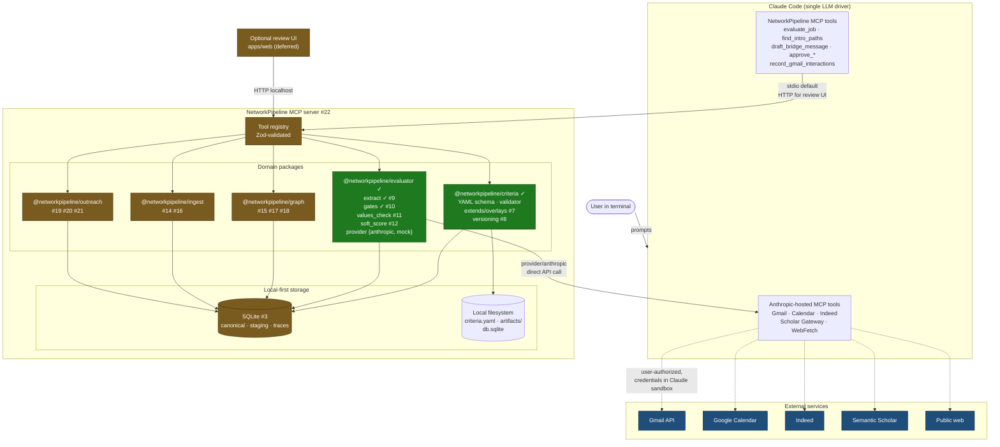
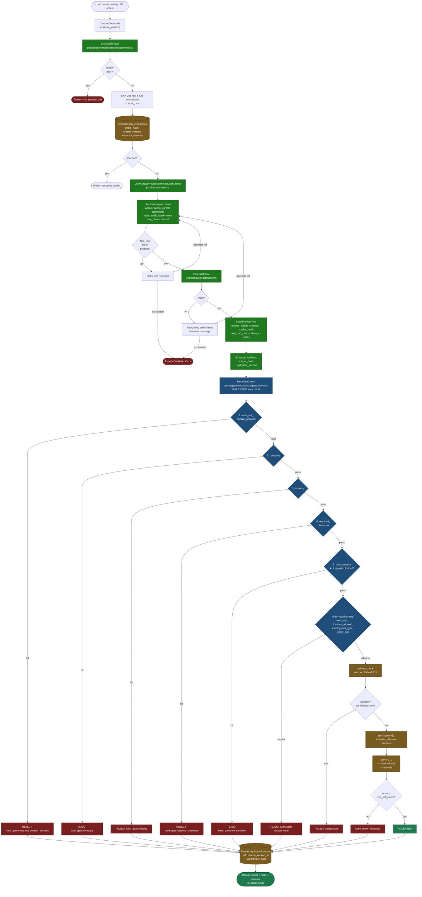
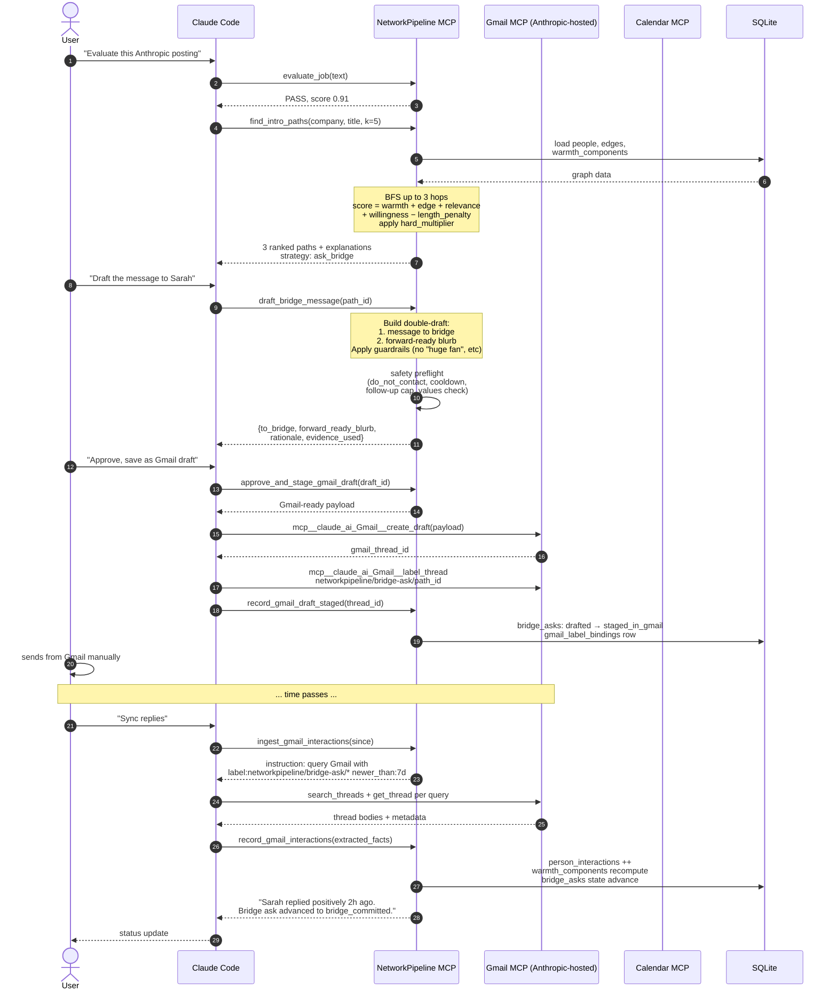
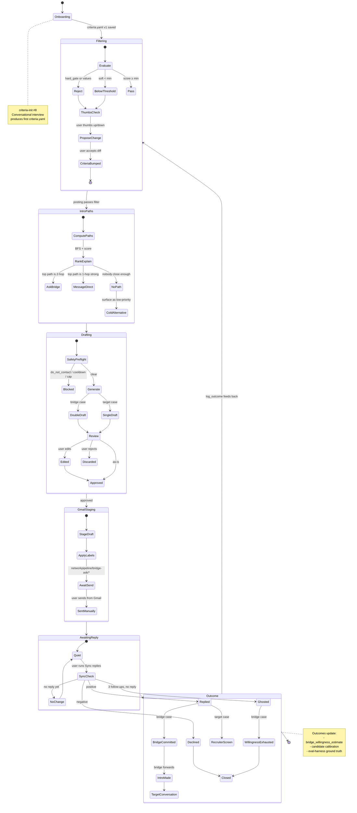
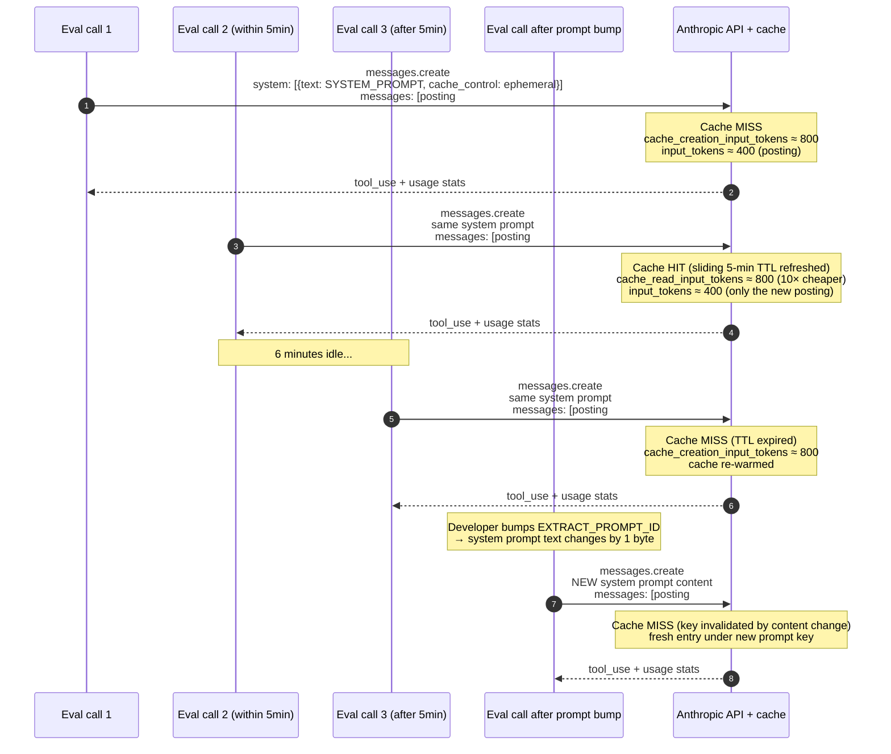
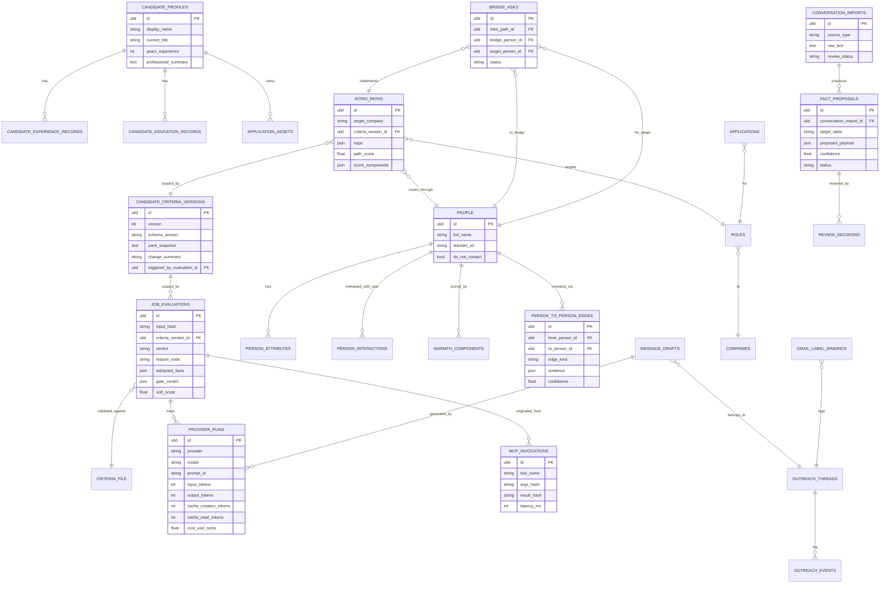

# System and Flow Diagrams

This doc collects mermaid diagrams for NetworkPipeline at four levels of zoom:

1. [System topology](#1-system-topology) — who runs where, what depends on what
2. [Evaluation flow](#2-evaluation-flow) — one posting through the filter pipeline
3. [Intro-path flow](#3-intro-path-flow) — target role → ranked warm paths → drafted outreach
4. [Full lifecycle](#4-full-lifecycle) — filter → intro → outreach → reply detection
5. [Provider cache lifecycle](#5-provider-cache-lifecycle) — how the Anthropic prompt cache amortizes
6. [Data model overview](#6-data-model-overview) — canonical / staging / trace separation

Each diagram annotates with issue numbers (`#N`) for unbuilt pieces and `✓` for the parts already on `main`.

## 1. System topology

The architectural rule: **NetworkPipeline holds no third-party credentials.** Gmail, Calendar, and other external service access lives inside Claude Code's MCP sandbox; NetworkPipeline orchestrates via structured callbacks.

### Key boundaries

- **Claude Code is the only LLM caller** for orchestration. The evaluator package also makes a direct Claude API call from the Node process (the AnthropicJsonOutputProvider) — that's a separate API key from Claude Code's own session.
- **Gmail/Calendar credentials never enter NetworkPipeline.** The flow is: NetworkPipeline returns an instruction payload → Claude Code runs the Gmail MCP tool → Claude calls back into NetworkPipeline with structured results.
- **SQLite + local filesystem is the entire persistence layer.** No Redis, no Postgres, no S3 in V1.

## 2. Evaluation flow

What happens when a user runs `evaluate_job` on one posting. Files in italics show where each step lives in the repo.

### Why three stages

- **Hard gates** are deterministic code — auditable, free, and they catch the bulk of obvious rejects (clearance requirements, blocked companies, wrong seniority bands) without spending an LLM call.
- **Values check** is a narrow LLM call with a binary output. It catches semantic refusals that keyword filters can't (e.g., "this company makes ad-tech for adolescent gambling" wouldn't trigger any phrase blocklist).
- **Soft score** is the only stage that produces a float. Anchored by the user's calibration examples so it doesn't drift over time.

## 3. Intro-path flow

For any role that passes the filter, the intro-path engine answers "who do I know who can help me reach this?" with explainable ranking.

### Why double-draft

The "forward-ready blurb" is the difference between an intro that happens and an intro that gets stuck in your bridge's mental TODO list. It's a complete, paste-ready message they can forward verbatim — removes the friction that causes "I'll introduce you when I get a chance" to drag on.

## 4. Full lifecycle

The end-to-end loop a user runs across days or weeks: criteria refinement, evaluation, intro-path discovery, outreach, reply detection, and active learning.

### Why this loop matters for evals

Every state transition writes a row somewhere — `outreach_events`, `bridge_asks` lifecycle, `outcome_labels` — that becomes ground truth for the eval harness (`docs/evaluation.md` §3). Reply rates, intro success rates, bridge-willingness calibration all flow from this lifecycle data.

## 5. Provider cache lifecycle

How `cache_control: ephemeral` actually saves money in practice.

### Why this matters operationally

- **Bulk evaluation of 10 postings within 5 minutes:** 1 cache-creation + 9 cache-reads. ~10× cost reduction on the cached prefix.
- **Walking away for an hour:** next call eats one cache-creation. Negligible.
- **Prompt versioning via `EXTRACT_PROMPT_ID`:** any deliberate prompt change forces re-warming, which is what we want — old cached entries reflect old behavior.
- **Cache is opportunistic, not load-bearing.** Correctness is independent of hit rate. Cost and latency are not. We measure both via `cache_creation_tokens` and `cache_read_tokens` on every `ProviderRun`.

## 6. Data model overview

The schema separates three logical layers (full spec in `docs/schema.md`).

### Three-layer separation

- **Canonical** (people, roles, applications, message_drafts, bridge_asks, intro_paths, candidate_profiles) — the approved system of record the product reads from for ranking, drafting, and UI.
- **Staging** (conversation_imports, fact_proposals, review_decisions) — raw imports and AI proposals waiting for user approval. Never used directly by recommendation logic.
- **Trace** (provider_runs, mcp_invocations, candidate_criteria_versions, job_evaluations, outcome_labels) — observability and reproducibility data. The eval harness reads from here to compute precision/recall and ablation tables.

The rule: AI extractions land in staging, get reviewed, then flow to canonical. Trace tables are append-only and never gate behavior.

## Where to look in code

| Diagram concept | File |
|---|---|
| `extractJobFacts` flow | [packages/evaluator/src/extract/extract.ts](../packages/evaluator/src/extract/extract.ts) |
| Anthropic adapter + caching | [packages/evaluator/src/provider/anthropic.ts](../packages/evaluator/src/provider/anthropic.ts) |
| Hard-gate pipeline | [packages/evaluator/src/gates/check.ts](../packages/evaluator/src/gates/check.ts) |
| Gate ordering and reason codes | [packages/evaluator/src/gates/result.ts](../packages/evaluator/src/gates/result.ts) |
| Criteria YAML schema | [packages/criteria/src/schema.ts](../packages/criteria/src/schema.ts) |
| Criteria load + path resolution | [packages/criteria/src/load.ts](../packages/criteria/src/load.ts) |
| Provider abstraction | [packages/evaluator/src/provider/types.ts](../packages/evaluator/src/provider/types.ts) |

## Related docs

- [Architecture](./architecture.md) — narrative version of these diagrams
- [Criteria System](./criteria.md) — the YAML schema and gate semantics
- [Intro Path Engine](./intro-paths.md) — ranking math and outreach contracts
- [Evaluation Harness](./evaluation.md) — how every flow above gets measured
